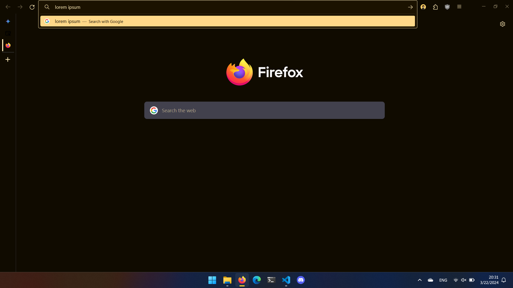

  
  # Firefox Config
  
  

## Required Extensions
- [Firefox Color](https://addons.mozilla.org/en-US/firefox/addon/firefox-color/)
- [Tab Center Reborn](https://addons.mozilla.org/en-GB/firefox/addon/tabcenter-reborn/?utm_source=addons.mozilla.org&utm_medium=referral&utm_content=search)

## Installation
### Theme
To install the theme click [here](https://color.firefox.com/?theme=XQAAAAIlAgAAAAAAAABBKYhm849SCicxcUCyhXcGHf3p79EhVPUEQrvEmu_nKXFAW1wfw7l4mmpG1B1c-QOYLNGAa-nppyAayYYdTnArT2CdBCt6tctYGj6Y3vvrplptyWaObmOFXFYu_bknvrrxVQh2hthquPkCeflgW0DUlG3oiqPhWxOCPd7G8Eq9paZj-tm_tlHkj2FrebW9rIimvmP-x20sZHuTnPlbZLQ4pNoYrDLaE3oo5Z4XWR5WJ4SrE1ZBIFRX1OgVLq5MRokcfYDeKz_GTyLGSLOY5FaXGy2Y0YGvDhRGL-ygH51qb7bm8U3uQSsTqc_7ACVwsoj-867f-A)

### Others
This config uses the user chrome css for the side tab bar to properly work. To install it copy the chrome folder into the release user in firefox directory:

Linux: `~/.mozilla/firefox/{profile}-release/`

Windows: `{AppData}\Roaming\Mozilla\Firefox\Profiles\{profile}-release`
